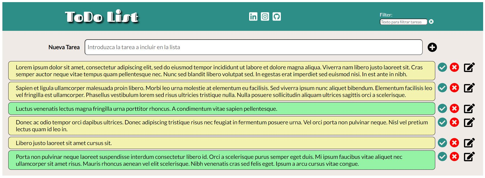

### Bootcamp Full Stack Developer - Upgrade Hub
## Proyecto JavaScript - ToDo List
---

Página Web creada utilizando HTML5, SCSS (CSS) y JavaScript como proyecto del segundo módulo del bootcamp.

La idea es Crea una aplicación que nos permita añadir tareas, editar y eliminarlas. Todo el mundo necesita una ayuda para recordar todas esas tareas que necesitamos hacer día a día.

* Todo el código fuente está disponible en el repositorio:
[https://gitlab.com/jleal22/proyecto-javascript-todolist-jesus-leal](https://gitlab.com/jleal22/proyecto-javascript-todolist-jesus-leal)

...

**Estructura:**

Componentes creados:
- index.html
- app.js
- styles/styles.scss
- styles/style.css (Generado a partir de styles.scss)
- images/*
